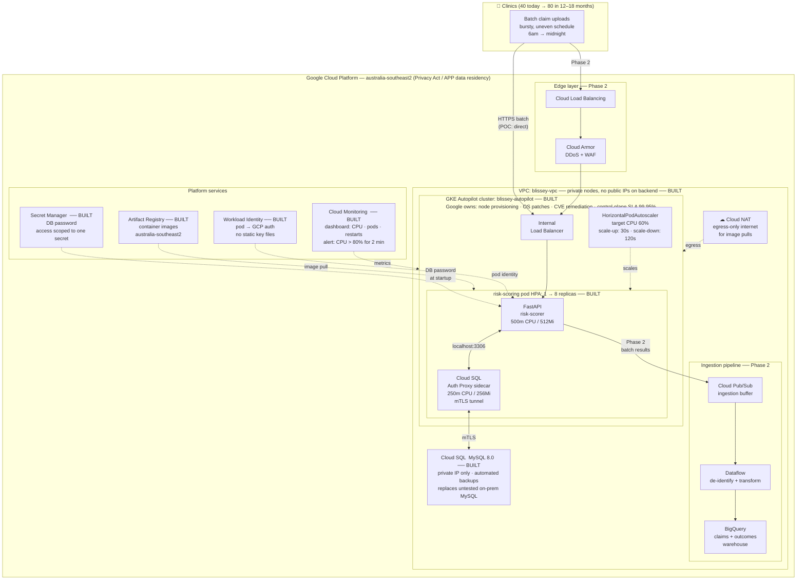

# Architecture Diagram — Blissey Health Analytics on GKE Autopilot

> **Legend**
> - **BUILT** — working in this POC, demoable live
> - **Phase 2** — diagrammed and described, not built; documented next step
>
> Calling this split out explicitly is intentional. Knowing what to build vs. what to
> responsibly describe is part of what's being evaluated for a CE role.

---

---

## Reading the diagram in the presentation

**Start with the clinics (top left):** "40 clinics, each uploading on their own schedule.
6am from one, midnight from another. That's your actual load shape — bursty, uneven,
hard to size for statically. That's what we modelled."

**Walk the request path:** Clinic → (Phase 2: Cloud Load Balancing + Cloud Armor) →
Internal Load Balancer → FastAPI pod → Cloud SQL Auth Proxy sidecar → Cloud SQL.
"The database has no public IP. The proxy handles a mutual-TLS tunnel. Nothing in
the YAML contains a credential."

**Point to the GKE Autopilot box:** "This is the answer to 'why not just run GKE
ourselves again.' Everything inside this boundary — node provisioning, OS patches,
CVE remediation, control-plane availability — is Google's problem, not yours. The
March 14-hour outage was a self-managed control-plane failure. This cluster carries
a 99.95% SLA on the control plane."

**Point to the HPA:** "min 1 pod at 3am when nothing is uploading. Max 8 pods during
the mid-morning burst. Autopilot provisions the node capacity underneath automatically.
You pay for the pod compute you use, not for headroom you guessed at."

**Point to the Phase 2 pipeline:** "Pub/Sub and Dataflow are the real ingestion
architecture — a buffer that absorbs clinic uploads and a pipeline that de-identifies
data before it lands in BigQuery. We didn't build this in the POC because building
a half-finished pipeline would have been theater. The diagram shows where it fits."

**Point to platform services:** "Workload Identity, Secret Manager, least-privilege
IAM, Cloud Monitoring — these are built and working. This is what 'we've thought
about security' looks like to an auditor, vs. what the current setup looks like."

---

## What changed from current state

| | On-prem today | GKE Autopilot |
|---|---|---|
| Node patching | Your team, ~30% eng time | Google — SRE team, automated |
| Control-plane failure | March: 14hr outage, no SLA | 99.95% SLA, regional cluster |
| DB backups | Untested, no retention policy | Automated, point-in-time recovery |
| Credentials | Unknown (contractor config) | Workload Identity + Secret Manager |
| Scales to idle | No — static provisioning | Yes — HPA min 1 pod |
| Audit evidence | Hard to produce | IAM, Cloud Audit Logs, Secret Manager access log |
